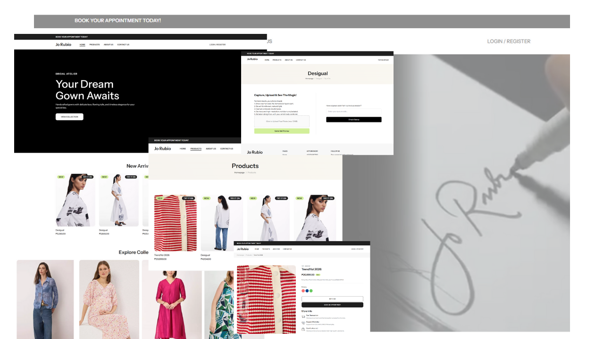

## Overview

## Main Features

### Customer Features

- **3D Virtual Try-On** - Upload a photo and see how gowns look on you in 3D
- **Browse Products** - View available gown designs with images and details
- **Book Appointments** - Schedule consultations and fittings online
- **Account Dashboard** - Track orders and manage appointments
- **Contact & Support** - Get help and ask questions about designs

### Admin Features

- **Product Management** - Add, edit, and organize gown designs
- **2D to 3D Conversion** - Upload 2D images that convert to 3D models
  automatically
- **Appointment System** - View and manage customer bookings
- **Customer Database** - Track customer information and orders
- **Analytics Dashboard** - Monitor sales and business performance
- **Email Notifications** - Automated updates for customers

## How It Works

### For Customers

1. Browse the gown collection
2. Upload a photo for virtual try-on
3. View yourself in different gowns using 3D visualization
4. Book an appointment if interested
5. Track your order progress

### For Business Owners

1. Upload gown designs (2D images)
2. System generates 3D models using Google Gemini AI
3. Manage incoming appointments and inquiries
4. Process orders and track customer preferences
5. Review analytics to understand what's selling

## Technology Used

**Frontend**

- Tailwind CSS for styling
- Alpine.js for interactivity
- Vanilla JavaScript

**Backend**

- Laravel 11 with Livewire
- MySQL database

**3D Features**

- Google Gemini AI for 2D to 3D conversion
- Model Viewer for rendering 3D models

## The Problem It Solves

Buying custom gowns online is difficult because customers can't see how the
dress will look on them. Stitch Sense fixes this by:

- Showing realistic 3D previews before purchase
- Reducing returns from mismatched expectations
- Allowing remote consultations and bookings
- Making custom gown services accessible to more people

## Project Goals

This application demonstrates:

- Integration of AI for practical business use
- 3D visualization in web applications
- Full-stack development with modern tools
- E-commerce functionality with appointment scheduling
