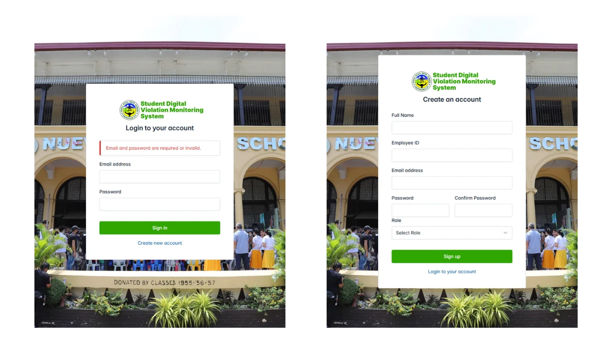
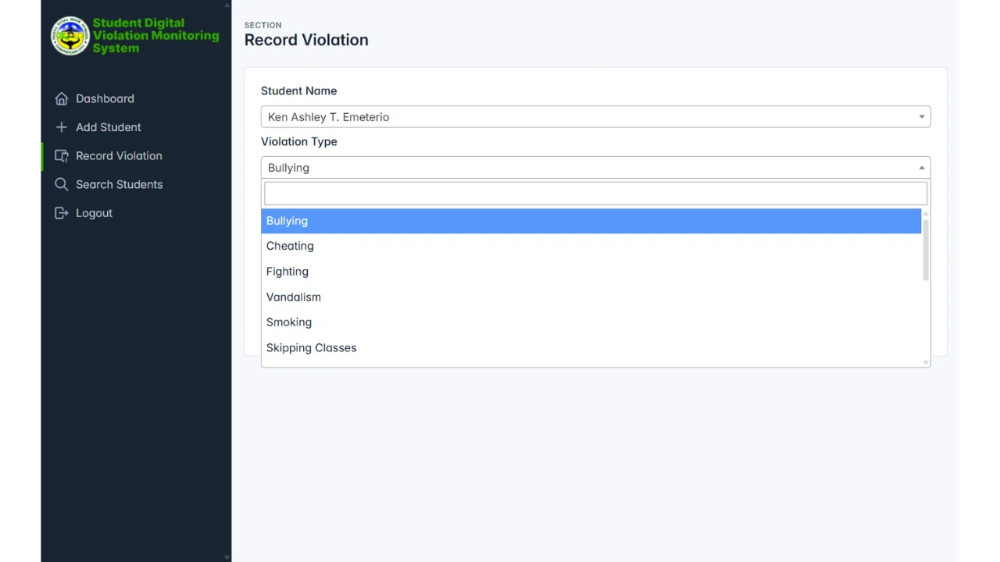
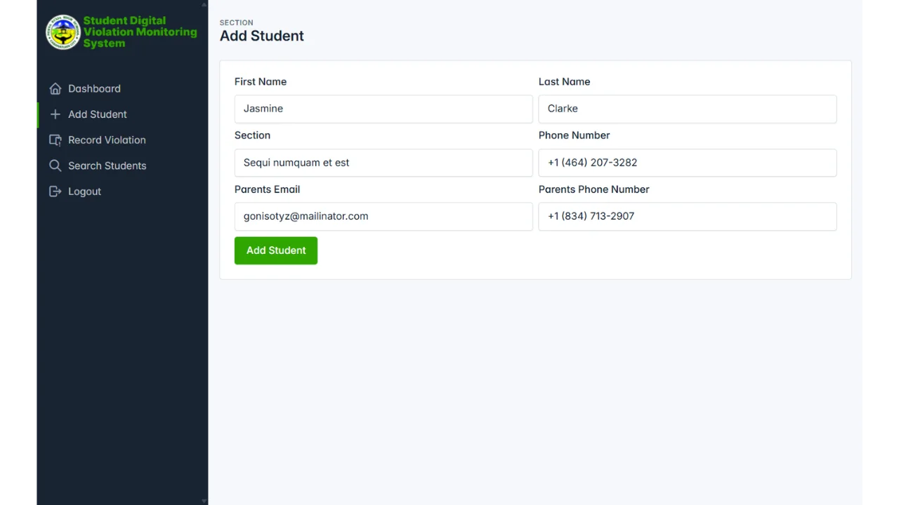
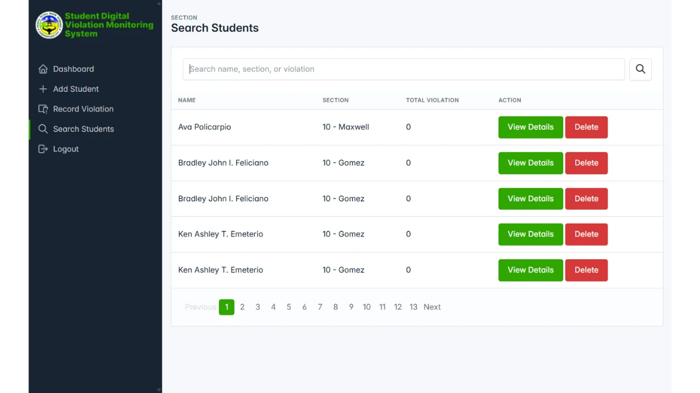
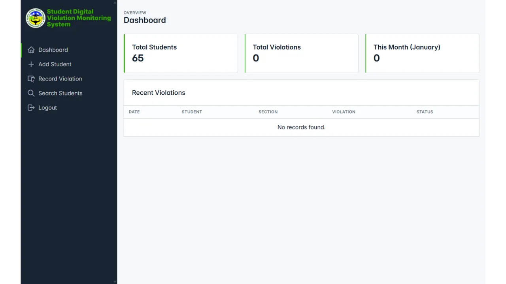
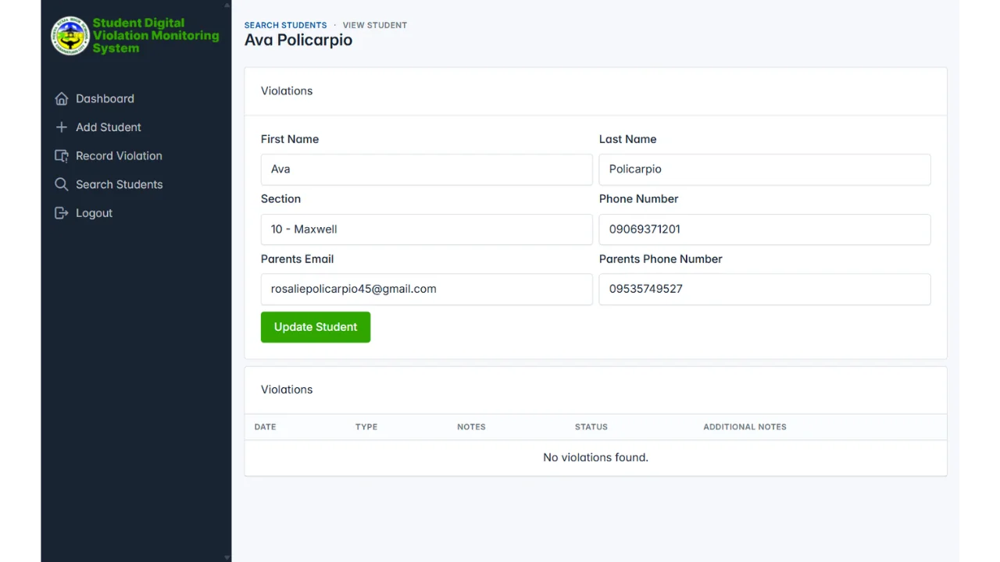

## Overview

A web application built to digitize student violation tracking. The system
allows school administrators to record student infractions, maintain
comprehensive records, and automatically notify parents via email when
violations occur. This replaces manual paper-based tracking with a centralized
digital platform.

## Key Features

### Secure Authentication

Role-based login system ensures only authorized school staff can access the
platform. Includes registration for new staff members with employee ID
verification.

### Violation Recording

Track different types of violations including tardiness, dress code infractions,
etc. Each violation entry includes the date, type, description, and status.

### Automated Email Notifications

When a violation is recorded, the system automatically sends an email to the
student's parents with details about the incident. This ensures immediate
communication without requiring manual follow-up.

### Student Management

Register and maintain student records including personal information, section
assignments, and parent contact details. Administrators can add new students,
update existing records, and search the database efficiently.

### Search and Lookup

Quickly find students by name, section, or violation type. The search feature
includes pagination for browsing large numbers of records.

### Dashboard Analytics

View key metrics including total students, total violations, and monthly
violation counts. The dashboard shows recent violations at a glance.

### Student Profile View

Access detailed information about individual students including their complete
violation history, contact information, and parent details. Staff can update
student information as needed.

## Technology Stack

### Frontend

- HTML, CSS, JavaScript
- Bootstrap for responsive design
- jQuery and Select2 for enhanced UI

### Backend

- PHP for server side logic
- MySQL database for data storage
- Composer for dependency management

### Email Integration

- SMTP configuration for automated notifications
- Compatible with Gmail, Mailtrap, and other email services

### Development Environment

- XAMPP for local testing
- Session management for user authentication
